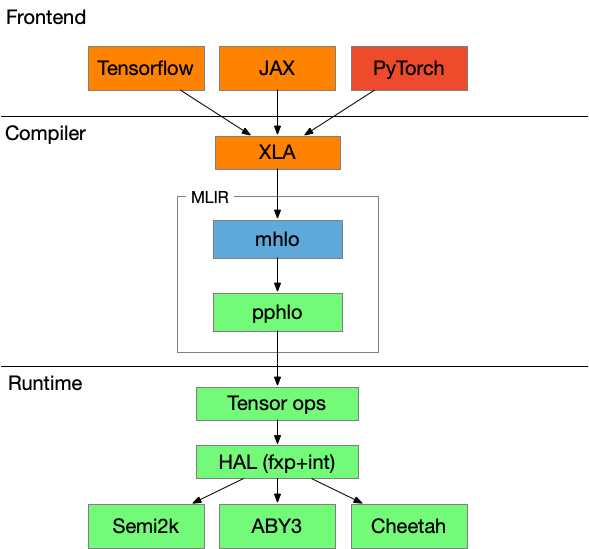

# Repository Layout

This is a high level overview of how the repository is laid out. Some major folders are listed below:

* [bazel/](bazel/): Configuration for SPU's use of [Bazel](https://bazel.build/).
* [docs/](docs/): Documents of SPU.
* [examples/](examples/): Contains both cpp and python examples of SPU.
* [libspu/](libspu/): Core C++ implementations of SPU.
  * [compiler/](libspu/compiler/): SPU's compiler stack. It accepts the standard XLA IR along with
                                   inputs mpc metadata and lowering the XLA IR to an mpc specific IR.
  * [core/](libspu/core/): Basic data structures used in SPU.
  * [device/](libspu/device/): SPU device `Runtime`. It consists of IO(infeed, outfeed),
                               symbol tables(storage) and the IR executor.
  * [dialect/](libspu/dialect/): Internal MPC-specific IR used by SPU.
  * [kernel/](libspu/kernel/): SPU runtime kernels.
    * [hlo/](libspu/kernel/hlo/): High level operations, which match the definition of pphlo.
    * [hal/](libspu/kernel/hal/): Hardware abstraction layer which implements crypto-independent core
                                  logics, fixed-point related abstractions and some non-linear APIs.
                                  It could be viewed as a builtin library in addition to the SPU VM.
  * [mpc/](libspu/mpc/): Various mpc protocols. This folder defines the [standard interface](libspu/mpc/apis.h)
                         different mpc protocols need to conform.
    * [aby3/](libspu/mpc/aby3/): The semi-honest variant of ABY3 protocol.
                                 Currently only `Arithmetic` and `Boolean` are implemented.
    * [cheetah/](libspu/mpc/cheetah/): An excellent semi-honest 2PC protocol implemented by [Alibaba-Gemini-Lab](https://alibaba-gemini-lab.github.io/).
    * [semi2k/](libspu/mpc/semi2k/): The semi-honest variant of SPDZ protocol.
                                     It could be shipped with different correlated random generators.
    * [ref2k/](libspu/mpc/ref2k/): A plaintext protocol. It is aimed to serve as a reference implementation
                                   of how a new protocol could be added in SPU.
    * [util/](libspu/mpc/utils/): Common utilities for different mpc protocols.
* [spu/](spu/): Python binding of libspu.
