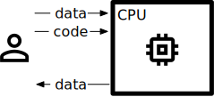
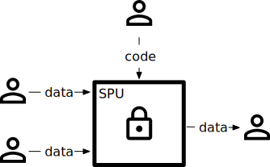
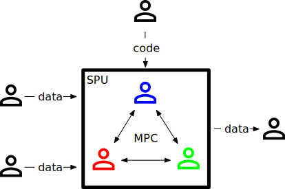
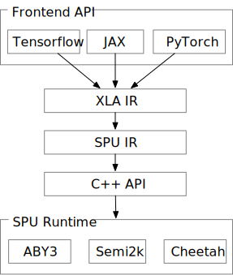

Basic concepts
==============

SPU has quite a different programming model than CPU/GPU, this guide introduces the basic concepts.

Machine model
-------------

In normal CPU model, we could treat the machine as an *arithmetic blackbox*, which accepts user's *code* and *data*, runs the computation, and returns result *data* to user. If we draw a picture to show the relationship between user and machine, it's something like this.

   user and CPU

In SPU, the first notable difference is that, *input* is not provided by a single user, it's from **multiple parties**, and the *code* could be provided by a separate party, finally, the output could be received by another party. So **SPU is born to be used in a distributed context**. It looks like:

   multi-user and SPU

If we take a closer look, SPU itself is not a physical machine, it is hosted by multiple parties that don't trust on each other. For example, in the following picture, we have three parties (red, blue and green) that work together with some MPC protocols, and provide computation service as a **virtual machine**.

   inside SPU

So we have treated SPU as a (multi-party visualized) **secure arithmetic blackbox**, which can evaluate computations securely.

Programming model
-----------------

With the above VM model, the next question is **how to program on it**?

Inside SPU, each physical node behaves differently for the same progress, i.e. some nodes act as senders, while others act as receivers.

But from the users' (of SPU) perspective, SPU behaves as one single VM. One important responsibility of SPU compiler/runtime pipeline is to translate **homogeneous** program to another for **heterogeneous** runtime engines.

For example, in the following computation graph, given `x`, `y`, we want to compute `f(x, y)`, and the big circle represent a compute node which can evaluate f.

.. image:: ../imgs/physical_eval.svg

In SPU, a group of nodes work together to provide functionality of `f`, as shown blow.

.. image:: ../imgs/virtual_eval.svg

With the above abstraction, SPU can:

* Hide the underline protocols, *write once, run on all protocols*.
* Hide the number of parties, *write once, run for a variable number of parties*.

API level
---------

With the above programming model, the next question is **which language is supported**? SPU provides multi-level API, from upper to lower:

- **Frontend API** (like TensorFlow/JAX), SPU compiles them into SPU IR before running.
- **SPU IR**, an Intermediate Representation format defined by SPU, which is not quite readable but easier for computers to understand.
- **C++ API**, which could directly access the underline MPC protocols.

The API hierarchy looks like:

   SPU API hierarchy

.. important::
   An important goal of SPU is to allow people to write secure programs with their familiar frameworks they are familiar with, so it's recommended to use Frontend API.

   Currently, only JAX frontend is supported for now. Please check :doc:`JAX on SPU <../getting_started/quick_start>`.
