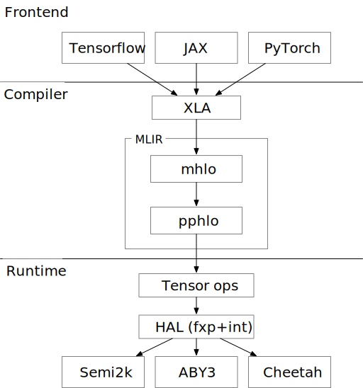

SPU Compiler
============

The SPU compiler aims to provide state-of-the-art compiler support from the different ML frameworks to SPU runtime.

`MLIR <https://mlir.llvm.org/>`_ The MLIR project is a novel approach to building reusable and extensible compiler infrastructure. MLIR aims to address software fragmentation, improve compilation for heterogeneous hardware, significantly reduce the cost of building domain specific compilers, and aid in connecting existing compilers together.

`XLA <https://www.tensorflow.org/xla/architecture>`_ Multiple Vendors use XLA as the middle layer, mapping from platform frameworks like PyTorch, JAX, and TensorFlow into XLA and then progressively lowering down to their target hardware.

`MLIR-HLO <https://github.com/tensorflow/mlir-hlo>`_ MLIR-HLO project connects XLA into MLIR world. 

Having canonical lowerings from different frontend frameworks to the MLIR ecosystem would provide much needed relief to hardware vendors to focus on their unique value rather than implementing yet another frontend for SPU. The goal is to add LLVM target support similar to current hardware vendors, rather than every vendor implementing a Clang/C++ frontend.

All the roads from ML frameworks to SPU
---------------------------------------

