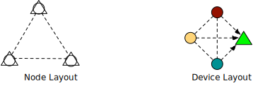
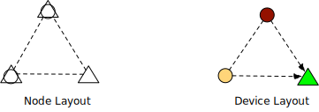
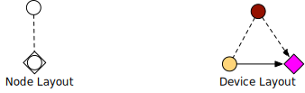
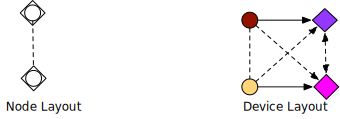
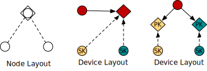
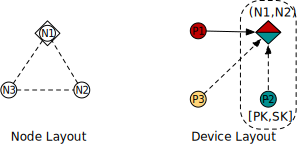

Design: generic device
======================

.. warning::
   This is a design draft for using SPU from SecretFlow, not an accurate document for SPU itself. It could be treated as a reference to integrate SPU from other system.

Overview
--------

This document discusses the trust chain design under an universal device concept.

Concept
-------

**Device**, a virtual concept which can evaluate a piece of code, normally a specific device provides some specific ability, i.e. CPU is a device for general computation, GPU is a device for parallel computation, HE/MPC evaluator are devices for security computation. Formally, a device is a set of ops :math:`\left \{  OP_{i} \right \}`.

- *DeviceObject* an object which could be operated by the device, formally, it's a set of data :math:`\left \{  D_{i} \right \}`.
- *Consistency property* is `if type(Di) == type(Dj) and OP works for Di, it also works for Dj`
- *Complete property* is that :math:`\left \{  OP_{i} \right \}` is *turing complete*

**Node**, a physical node which provides general computing environment, it could host devices.

**Computation** or DAG, is a form to to represent logic function, with *node* as operator and *edge* as data.

**SecretFlow**, is a framework could schedule a *Computation* to a list of *Device*, with respect that:

- **Securely data transferred** across devices, unless client explicitly make a unsafe transfer.
- Each op runs on exactly on one device, **there is no cross-device function**.

Notations
~~~~~~~~~

.. image:: ../imgs/device/notation.svg
    :width: 200
    :align: left

- *empty shape* stands for **Node**
- *colored shape* stands for **Device**
- *dotted line* stands for **no trust** relation between devices.
- *dotted line with arrow* stands for **weak trust** relation, one device could send its data encrypted to another without data loss.
- *solid line with arrow* stands for **strong trust** relation, one device could send its raw data to another without data loss.

|

Device layout
-------------

Outsourcing (MPC)
~~~~~~~~~~~~~~~~~

.. image:: ../imgs/device/outsourcing.svg

In above deployment, we use 6 nodes to construct 4 devices, with circle devices having weak trusts to the triangle device.

Colocated (MPC)
~~~~~~~~~~~~~~~

In above deployment, we use 3 nodes to construct 4 devices, with circle devices having weak trusts to the triangle device.

Note, in this configuration, we use 3 nodes to build exactly the same device layout as the 6 node out-sourcing mode, the client code could run exactly the same without change. That is **write once, run anywhere**.

Server-aided (MPC)
~~~~~~~~~~~~~~~~~~

In this configuration, one server does not provide data but do participate in the computation, it's so called a `server-aided`.

HE device
~~~~~~~~~

In this mode, we use 2 nodes to virtualize 3 device, with that:

- The *magenta device* colocated with *yellow CPU device*, with a *strong trust* relationship.
- The *red CPU device* and the *magenta HE device* forms a *weak trust* relationship.

In this configuration, we use 2 nodes to virtualize 4 device, with that:

- each *circle device* has one *strong trust* with one *diamond device* while a *weak trust* to another *diamond device*

In this configuration, we have 3 nodes. For clarity, we name upper one as Alice, lower-left as Bob, lower-right as Charlie.

Both {Bob, Charlie} would encrypt their data and send it to Alice, we have to possible device abstractions.

In the middle, there is only one *HE device*, which could be used to compute all cipher-text.

- pros: there is only one HE device per-node, which means if we have N parties, we have at most N HE-devices.
- cons: it breaks the *Consistency property*, i.e. `add::([x], [y])` add two cipher-text could not be done if two cipher-text comes from different parties. Another example: when doing output, Bob may get a cipher-text from the *HE-device*, but he can not decrypt it, since he does not have the right key. @jint, IMHO, *Consistency* is the key-point to guide programmers, **it's confusing if an op sometime work, sometimes not**. 

In the right configuration, there are 2 *HE device*, both resides on Alice, but one for Bob and one for Charlie.

- pros: Consistency, the device concept is exactly the same as MPC/TEE.
- cons: there will be at most :math:`N^2` HE devices for N nodes. This might not be a problem since it depicts the 2PC property of HE (@jint).

Device and Node
---------------

A device is composed by one or more nodes, this section covers the common used device/node pattern in SecretFlow.

For CPU and MPC, it's easy.

- A CPU device is composed by only one node.
- A MPC device is composed by a list of nodes (unordered).

For HE device, it's a bit of complicated, it's composed by a pair of nodes `(location, key-owner)`

- **Location node** is the node that the evaluator located on.
- **KeyOwner node** is the node that provides `{PK, SK}`

Formally, we can define devices via a configuration file.

.. code-block:: yaml

    nodes: [...] # list of nodes.
    devices: # list of devices
      - {device-name}    # the ith device name
        type: {dev-type} # the type of the device, one of {SPU, HEU, CPU, TEE}
        nodes: {composition-nodes}  # this is device type dependent, SPU=list of node, CPU=single node, HEU=node pair.

For example:

.. code-block:: yaml

    # We have three nodes, namely N1-N3
    nodes: [ "N1", "N2", "N3" ] 
    # We have four devices definition.
    devices:
      - SPU0: # the first one is SPU, which use three nodes
        type: SPU
        nodes: [ "N1", "N2", "N3" ] 
      - P1:
        type: CPU
        node: "N1"
      - P2:
        type: CPU
        node: "N2"
      - P3:
        type: CPU
        node: "N3"
      - HEU0: # the last one is HEU, which resides on N1, and use N2's key pair.
        type: HEU
        node: ("N1", "N2")
  

Let's ignore the SPU device for a moment, the CPU and HEU looks like this:

In this example, `HEU` computation part is strait-forward, the non-trivial part is the IO (device-to-device transfer). Let's consider several IO cases.

- First, transfer data from `P1` to `HEU`, in this case, from device concept level, `P1` **strong trust** on `HEU`, so it can send plaintext directly to `HEU`. In implementation, `P1` colocated with `HEU`, so it make sense for a plaintext transfer.
- Second, transfer data from `P2` to `HEU`, in device concept, `P2` **weak trust** `HEU`, so it has to encrypt the data with SK, then send to `HEU`. From implementation point of view, `P2` has the private key, so it can do the encryption.
- Third case, transfer data devices other than `P1` and `P2` to `HEU`, in this case, it's not colocated with `HEU` nor key-provider of `HEU`, it's just a participant, it has `weak trust` relationship with `HEU`, and will ask `PK` from the `HEU`.

.. mermaid::

    flowchart TB
    style P1 fill:#FF0000
    style HEU fill:#FF00FF
    style P2 fill:#FFFF00
    subgraph N1, evaluator
    P1((P1))-- Plaintext -->HEU{HEU}
    end

    subgraph N2, SK-PK
    P2
    end

    P2((P2))-- Ciphertext -->HEU
    P2-. PK .->HEU

    HEU-. PK .->P3
    P3((P3))-- Ciphertext -->HEU

    HEU-. PK .->P4
    P4((P4))-- Ciphertext -->HEU

As said before, when the IO is ready, it's trivial to fire jobs on it.

For output, a notable part of `HEU` is that, it could only reveal the result to the `key-owner` node. If you want to output to a node other than `key-owner node`, you have to ask key-owner node for help. This depicts the fact that HE is indeed a 2PC device, so more than 2PC cases should be handled specially.

.. mermaid::

    flowchart TB
    style P1 fill:#FF0000
    style HEU fill:#FF00FF
    style P2 fill:#FFFF00

    subgraph N2, SK-PK
    P2((P2))
    end

    subgraph N1, evaluator
    HEU{HEU}-- Ciphertext -->P2((P2))
    P2-- Plaintext -->P1((P1))
    end

    P2-- Plaintext -->P3((P3))
    P2-- Plaintext -->P4((P4))
