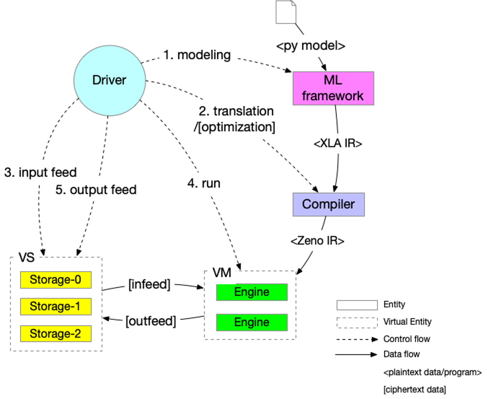

Design: workflow
================

.. warning::
   This is an early stage design document, the concepts may not match the implementation.

Concepts
--------

Components
~~~~~~~~~~

Before formal definition of SPU components, we define kinds of entities first.

- *Entity*: an entity is a lib/process/service which could be deployed to provide some functionalities.
- *Virtual entity*: a virtual entity is a group of entities which cooperates to provide some functionalities.

SPU component is an entity or virtual entity.

- **Compiler**: is an entity which translates/optimizes a XLA DAG to a SPU DAG.
- **(Compute) Engine**: is an entity that cooperates with other engines to do secure evaluation.
- **Virtual Machine**: is a virtual entity which consists of a group of engines, and can launch a SPU computation.
- **Storage Engine**: is an entity which provides input data (data provider) or receives output data (data sink).
- **Virtual Storage**: is a virtual entity which contains a group of storage engines.
- **Driver**: is an entity which drives all entities/virtual engines to jointly complete a secure evaluation.

SPU components are typically hosted by several parties which do not trust each other. We usually assign different roles to these parties.

Kind of roles:

- **Data provider**: which hosts storage engine.
- **Algorithm provider**: which provides the algorithm.
- **Computing provider**: which hosts one or more compute engines.

Note, one party may have multiple roles, for example:

- one party could provide data while also participate in the computation.
- one party could host all compute engines and claim that engines do not collude with each other, that is the 'out-sourcing mode'.

Compare to classic architecture
~~~~~~~~~~~~~~~~~~~~~~~~~~~~~~~

.. list-table:: comparison to classic architecture.
   :widths: 25 25 50
   :header-rows: 1

   * - SPU
     - Classic
     - Difference
   * - SPU VM
     - CPU
     - SPU VM composed by multiple engines who follows MPC protocol
   * - SPU VS
     - Disks
     - SPU storage composed by multiple participants who do not trust each other 
   * - Data infeed
     - Disk read
     - SPU data infeed will make data invisible to engines.
   * - Data outfeed
     - Disk write
     - SPU data output will reveal value from engines.

Deployment
~~~~~~~~~~

A SPU component can be deployed:

- **As a lib**: used by other applications, (i.e. python runtime)
- **As a binary**: that could be used as a standalone program.
- **As a service**: that could be called remotely.

.. list-table:: Component deployment method.
   :widths: 25 50 50 50
   :header-rows: 1

   * - Component
     - As a lib
     - As a binary
     - As a service
   * - Compiler/C++
     - expose pybind
     - standalone compiler
     - close-source, focus on optimization
   * - Engine/C++
     - N/A
     - N/A
     - standalone service program
   * - Storage Engine/C++
     - N/A
     - N/A
     - standalone service program
   * - Driver/python
     - expose pybind
     - N/A
     - N/A

Deployment unit.

- **SPU Daemon**: is a program that serves *compute engine* or *storage engine*
- **SPU Compiler**: is a program that translates/optimizes XLA IR to SPU IR.
- **driver**: is a lib which drives compile/data-placement/run pipeline.

Workflow
--------

The following diagram shows a typical control flow of SPU computation.

The whole control flow is driven by the driver/controller.

1. Ask ML framework to compile a model into XLA IR.
2. Ask SPU Compiler to compile XLA IR into SPU IR.
3. Ask storage engines to infeed data to engine's symbol table.
4. Ask compute engines to run SPU IR.
5. Ask storage engine to outfeed from engine's symbol table.

Simple workflow
~~~~~~~~~~~~~~~

The following diagram shows detailed steps:

.. mermaid::

  sequenceDiagram
    autonumber
    participant Driver
    participant TF as TF
    participant Compiler
    participant VS as Virtual Storage
    participant VM as Virtual Machine

    Driver->>Driver: write tf program

    Driver->>+VS: initiate Dataset
    VS->>-Driver: ref to remote dataset

    loop [model.fit foreach minibatch]
      Driver->>+VS: next(Dataset)
      VS->>-Driver: ref to remote tensor

      Driver->>+TF: ask tf to compile tf.function (with ref tensor)
      TF->>-Driver: XLA.HLO (may cached)

      Driver->>+Compiler: ask SPU Compiler to compile XLA.HLO
      Compiler->>-Driver: XLA.HLO [optional] + infeed + SPU IR (may cached)

      Driver-->>VS: ask virtual storage to infeed
      activate VS
      VS-->>VM: infeed data
      deactivate VS
      activate VM
      VM-->>VS: ref or error
      deactivate VM
      activate VS
      VS-->>Driver: ref or error
      deactivate VS

      Driver-->>+VM: ask virtual machine to run SPU IR
      VM-->>-Driver: ref or error

      Driver-->>VS: ask virtual storage to gather result data
      activate VS
      VS-->>VM: outfeed data
      deactivate VS
      activate VM
      VM-->>VS: ref or error
      deactivate VM
      activate VS
      VS-->>Driver: ref or error
      deactivate VS
    end

- **step 1**, driver writes a normal tensorflow program that could be decorated with `tf.function`.
- **step 2-3** driver asks virtual storage to instantiate dataset.
- **step 4-5** driver asks virtual storage to load next batch, get a reference to remote tensor.
- **step 6-7** driver asks tensorflow engine to compile the program into XLA.HLO, with reference tensor.
- **step 8-9** driver asks SPU Compiler to compile the XLA.HLO into SPU IR.
- **step 10-13** driver asks virtual storage to infeed data into VM's symbol table.
- **step 14-15** driver asks VM to run compiled SPU IR.
- **step 16-19** driver asks virtual storage to outfeed data from VM's symbol table.

In the above steps, **step 4-5**, **step 10-19** are virtual steps, since both virtual machine and virtual storage are *virtual object* that can not be interacted directly.

The concrete steps is defined by the virtual machine and storage layout. For example:

- suppose we have 2 data sources *Alice* and *Bob*, where *Alice* also acts as a data sink.
- suppose we have 3 compute engines, which compose a 3-PC virtual machine.
- suppose input `x` comes from *Alice*, `y` comes from *Bob*, and the output `z` is revealed to *Alice*.

Data load
"""""""""

.. mermaid::
  :align: left

  sequenceDiagram
    autonumber
    participant Driver
    participant D0 as Alice
    participant D1 as Bob

    par [ask Alice load data]
      Driver->>+D0: ask Alice to load data `x`
      Note over D0: Load `x`, maybe from local csv file.
      D0->>-Driver: done or error

    and [ask Bob to load data]
      Driver->>+D1: ask Bob to load data `y`
      Note over D0: Load `y`, maybe from local database.
      D1->>-Driver: done or error

    end

- **step 1-2** *Alice* loads symbol 'x' into it's local symbol table.
- **step 3-4** *Bob* loads symbol 'y' into it's local symbol table.

Data infeed
"""""""""""

The above **step 9-12** does data infeed, the concrete steps look like:

.. mermaid::
  :align: left

  sequenceDiagram
    autonumber
    participant Driver
    participant D0 as Alice
    participant D1 as Bob
    participant E0 as Engine-0
    participant E1 as Engine-1
    participant E2 as Engine-2

    par [ask Alice to place data]
      Driver->>+D0: ask Alice to split & place data.
      D0->>D0: Split x into (x1, x2, x3)
      par [send x0 to E0]
        D0->>E0: x0
      and [send x1 to E1]
        D0->>E1: x1
      and [send x2 to E2]
        D0->>E2: x2
      end

    and [ask Bob to place data]
      Driver->>+D1: ask Bob to split & place data.
      D1->>D1: Split y into (y1, y2, y3)
      par [send y0 to E0]
        D1->>E0: y0
      and [send y1 to E1]
        D1->>E1: y1
      and [send y2 to E2]
        D1->>E2: y2
      end

    end

- **step 1-5** and **step 6-10** ask *Alice* and *Bob* to do infeed simultaneously, and could be done in parallel.
- **step 2**, *Alice* splits `x` into shares `(x1, x2, x3)`, note: this progress is mpc-protocol dependent.
- **step 3-5**, *Alice* sends slices of `xi` to each of the engines, could be done in parallel.
- **step 6-10**, *Bob* does the same thing as *Alice*.

Run
"""

.. mermaid::
  :align: left

  sequenceDiagram
    autonumber
    participant Driver
    participant E0 as Engine-0
    participant E1 as Engine-1
    participant E2 as Engine-2

    Note right of Driver: all input data have been fed in engines' symbol table already

    par [ask E0 to run]
    Driver->>+E0: SPU IR
    E0->>-Driver: done or error
    and [ask E1 to run]
    Driver->>+E1: SPU IR
    E1->>-Driver: done or error
    and [ask E2 to run]
    Driver->>+E2: SPU IR
    E2->>-Driver: done or error
    end

    Note right of Driver: all output and captured data are in engines' symbol table.

- **step 1-2**, driver asks Engine-0 to run the compiled program, note, the input data is feed at this time.
- **step 3-4, 5-6** driver asks Engine-1 & 2 to do the same thing.

Data outfeed
""""""""""""

Note in this example, *Alice* also acts as the data sink, the output is revealed to *Alice*.

.. mermaid::
  :align: left

  sequenceDiagram
    autonumber
    participant Driver
    participant D0 as Alice
    participant E0 as Engine-0
    participant E1 as Engine-1
    participant E2 as Engine-2

    Driver->>D0: ask to collect output data.
    par [ask for slices]
      D0->>+E0: request for output z0
      E0->>-D0: z0
    and [ask for slices]
      D0->>+E1: request for output z1
      E1->>-D0: z1
    and [ask for slices]
      D0->>+E2: request for output z1
      E2->>-D0: z2
    end

    D0->>D0: Reconstruct z from (z1, z2, z3)

- **step 2-7** *Alice* gathers sharings of `z` from engines, note: this progress is mpc-protocol dependent.
- **step 8** *Alice* reconstructs the result locally.

Full workflow
~~~~~~~~~~~~~

The following diagram shows workflow with local VS local processing.

.. mermaid::

  sequenceDiagram
    autonumber
    participant Driver
    participant TF as TF@Driver
    participant Compiler
    participant VS as Virtual Storage
    participant VSXLA as TF@VS
    participant VM as Virtual Machine

    Driver->>Driver: write tf program

    Driver->>+VS: initiate Dataset
    VS->>-Driver: ref or error

    rect rgb(204, 255, 204)
      loop [model.fit foreach minibatch]
        Driver->>+VS: next(Dataset)
        VS->>-Driver: ref or error

        Driver->>+TF: ask tf to compile tf.function
        TF->>-Driver: XLA.HLO (may cached)

        Driver->>+Compiler: ask SPU Compiler to compile XLA.HLO
        Compiler->>-Driver: XLA.HLO [optional] + infeed + SPU IR (may cached)

        Driver-->>VS: ask virtual storage to run XLA.HLO + infeed
        activate VS
        VS->>+VSXLA: run XLA.HLO
        deactivate VS
        VSXLA->>-VS: ref or error
        activate VS
        VS-->>VM: infeed data
        deactivate VS
        activate VM
        VM-->>VS: ref or error
        deactivate VM
        activate VS
        VS-->>Driver: ref or error
        deactivate VS

        Driver-->>+VM: ask virtual machine to run SPU IR
        VM-->>-Driver: ref or error

        Driver-->>VS: ask virtual storage to gather result data
        activate VS
        VS-->>VM: outfeed data
        deactivate VS
        activate VM
        VM-->>VS: ref or error
        deactivate VM
        activate VS
        VS-->>Driver: ref or error
        deactivate VS
      end
    end

In the above picture, we can do local computation on *VS* side, which makes it suitable for FL like application.
