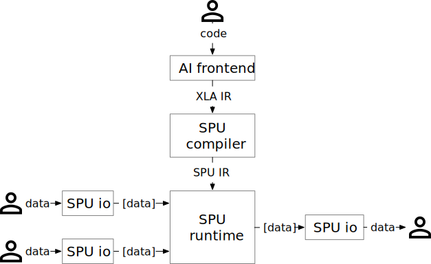

SPU Pipeline
============

Recall that SPU could be treated as a :ref:`virtual device <development/basic_concepts:Machine model>`. When working with a (virtual or physical) device, we need several steps.

1. infeed code to it
2. infeed data to it
3. trigger it to run
4. get result from it

This page describes details of each step.

Overview
--------

Before diving into the details, let's first take a closer look of SPU pipeline, it's something like this:

   code and data pipeline

Compilation
-----------

The vertical part depicts the compilation pipeline, from top to bottom.

1. Programmer writes code in AI frameworks(like TensorFlow/JAX).
2. AI frontend traces the DAG, and emits as XLA IR.
3. SPU compiler takes XLA IR, and compiles it to SPU IR, the format that SPU runtime understands.

For more details, please see :doc:`compiler` for details.

Data pipeline
-------------

The horizontal part depicts the data pipeline, from left to right.

1. Data providers use :ref:`SPU io <reference/py_api:Runtime IO>` module to encrypt input data.

   * For SPU MPC backend, *encrypt* means to split plaintext data into shares.
   * For floating point data, encoding to fixed-point may be also required.

2. The encrypted data is send to :ref:`SPU runtime <reference/py_api:Runtime Setup>`.
3. The output data is fetched *result owner*, and decrypted by the :ref:`SPU io <reference/py_api:Runtime IO>` module.

Just in time
------------

Jit is short for `Just-in-time compilation <https://en.wikipedia.org/wiki/Just-in-time_compilation>`_, with this approach, the compiler can get more information, such as input shapes, than in `AOT mode <https://en.wikipedia.org/wiki/Ahead-of-time_compilation>`_. Jit may introduce more evaluation overhead, but it's really trivial in secure computation setting.

In SPU, jit has more benefits since the backend engine may be orders of magnitude faster if it knows the *visibility* of data. For example, when multiplying two secrets, the backend MPC engine may involve expensive *beaver triple* progress, but when one of the inputs (of multiply) is public known to all parties, the operation will be much faster. So we should *mark* as much data as possible to be *public* (if it doesn't need to be protected), and tell the compiler these information.

So, SPU compilation normally happens after all data infeed is done, and `just in time` before the real evaluation.
