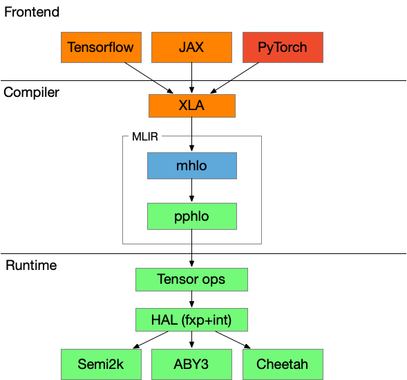

What is SPU?
============

SPU (Secure Processing Unit) is a domain-specific **compiler and runtime suite**, that aims to provide a **secure computation** service with **provable security**.

SPU compiler uses `XLA <https://www.tensorflow.org/xla/operation_semantics>`_ as its front-end Intermediate Representation (IR), therefore, SPU supports the XLA IR outputs from Tensorflow, Jax, or PyTorch. Internally, the SPU compiler compiles XLA to an MPC specific MLIR dialect which is later interpreted by SPU runtime. Currently, SPU team highly recommends using `JAX <https://github.com/google/jax>`_ and its sibling - `Flax <https://github.com/google/flax>`_.

SPU runtime implements various `MPC <https://en.wikipedia.org/wiki/Secure_multi-party_computation>`_ protocols (as the back-end) to provide **provable security**. SPU runtime is designed to be **highly extensible**, protocol developers can hack into MPC protocols with minimum effort and let the SPU compiler/runtime translate and interpret complicated frontend logic on it.

   High-level system architecture of SPU
