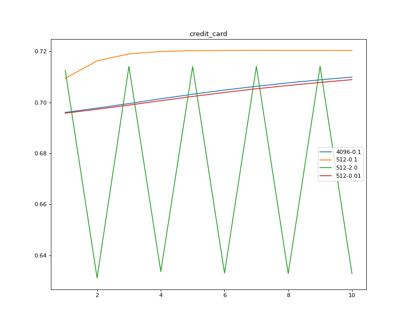
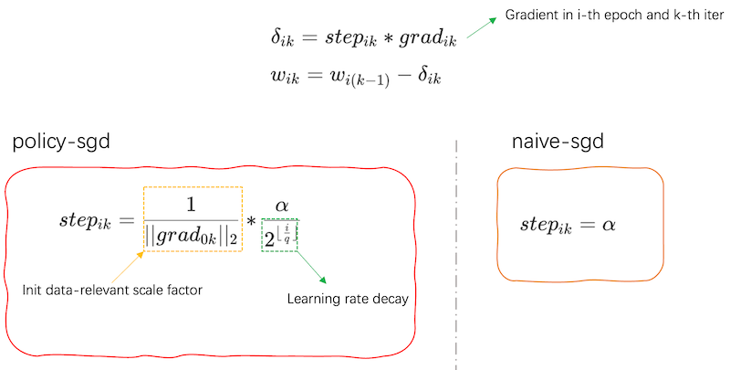
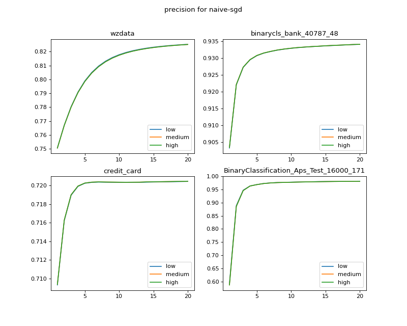
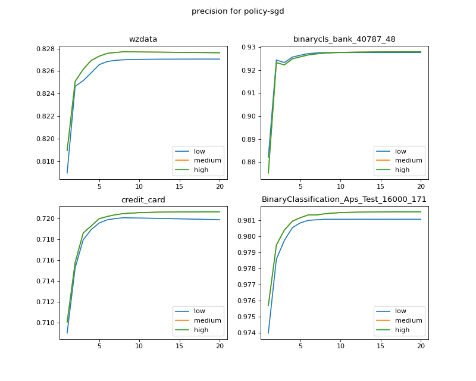
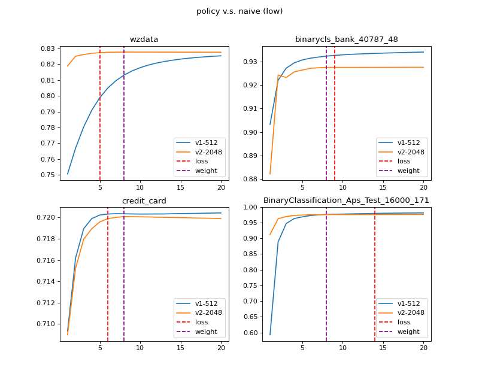

Background: SGD in MPC-ML
=================================

SGD(Stochastic Gradient Descent) is a famous optimization algorithm, it updates weights using gradient direction.
However, it suffers that user should choose hyper-parameters very carefully. Of course, grid-search is a potential treatment for this problem, but it becomes impractical when training cost is large.
As an example, When running LR with SGD in `credit card dataset <https://www.kaggle.com/datasets/uciml/default-of-credit-card-clients-dataset>`_ (for 4096-0.1, 4096 is batch_size, 0.1 is learning_rate),
we can find that it seems safer to use small batch_size and learning_rate, else we get some loss or very strong vibration of auc within 10 epochs(we leave 10000 samples as test dataset randomly).

Unfortunately, when under MPC, even simple algorithm like SSLR, small batch_size leads to huge training time under limited network resources. Besides, even you have high bandwidth,
small batch_size can not utilize it!

How to improve SGD
------------------------------
Indeed, after our elaborated experiments, we can find two drawbacks of naive SGD:

1. slow update(because of small learning_rate) at the beginning.

2. vibration happens when near to optimal point.

So, it's a straight strategy to use "large" learning_rate at the beginning, and "slow down" as training goes on.
But the ensuing question is how to determine specific "large" and "slow down" for different datasets.

What's Policy sgd
------------------------------
For SSLR, we provide an answer to the above question: policy-sgd(already implemented on `SSRegression` in Secretflow when setting `strategy=policy_sgd`).

The core of this optimizer consists of two parts:

1. Adaptive learning rate scaling mechanism: in first epoch, we force the weight move unit-norm in gradient direction and
record :math:`\frac{1}{||grad||_2}` as scale factor for this batch.

2. Learning rate decay and early stop: we use step-decay strategy for learning_rate decay. As for early stop, we
compare two strategies, loss based(use Taylor expansion to avoid invoking time-consuming op like `exp`, `log`)
and weight based, and choose the latter in our final implementation.

Experiments
------------------------------
We use 4 dataset for experiments, containing 3 open source dataset
(`credit_card <https://www.kaggle.com/datasets/uciml/default-of-credit-card-clients-dataset>`_,
`Bank Marketing <https://archive.ics.uci.edu/ml/datasets/Bank+Marketing#>`_,
`Aps <https://archive.ics.uci.edu/ml/datasets/APS+Failure+at+Scania+Trucks>`_)
and 1 business dataset(wzdata). For open source dataset, we just do some basic one-hot and min-max normalization like normal LR needs.
We leave out about :math:`\frac{1}{3}` data for test data and evaluate auc on it. The baseline auc is computed when using sklearn for model training.

+--------------------------+----------------+--------------+
|         Dataset          | Training shape | baseline auc |
+==========================+================+==============+
|     business dataset     | 111618，23     |   0.8175     |
+--------------------------+----------------+--------------+
|     Bank Marketing       | 40787，48      |   0.93       |
+--------------------------+----------------+--------------+
|     credit_card          | 20000, 23      |   0.718      |
+--------------------------+----------------+--------------+
|        Aps               | 60000，170     |   0.9666     |
+--------------------------+----------------+--------------+

Precision
-----------------

We first test how precision of fixed point influence SSLR and test three settings:

1. low precision: `FM64` + 18 fxp

2. medium precision: `FM128` + 28 fxp

3. high precision: `FM128` + 42 fxp

We can find that for both optimizer, precision has little influence on final auc, so it's safe for
user to choose low precision when training LR.

Naive v.s Policy
-----------------

Then, we compare the totally runtime of naive_sgd(v1) and policy_sgd(v2).
For naive-sgd, we follow the "safe strategy"(mostly used in plaintext ML): small learning_rate like 0.1, and small batch_size like 1024(If using 2048, then some data does not converge).
Also, it's hard to decide a good default value for naive_sgd to early stop well(even worse, you may get huge auc drop if setting bad values).
To avoid tedious grid-search, so for naive_sgd, it runs without any learning_rate decay(recommended way for naive_sgd).
But for policy_sgd, it's often harmless to use larger batch_size(2048 for these experiments),and we set learning_rate decay a half every 2 epochs.

As for other hyper-parameters, we set total running epochs to 20, learning_rate to 0.1 and use low precision, CHEETAH protocol.
And we test in WAN, providing 20Mbps and 20ms RTT, which is a typical setting in real world project.

First, we find for naive_sgd(v1), none of them meets any early stop criterion during 20 epochs(so we omit the early stop line in figure).
However, for policy_sgd(v2), it can always "stop well"(red dot line means policy_sgd meets the stop criterion based on loss, similar for purple line) after the model converges.
Besides, checking the auc of stopping time, it has very low gap(<0.01) between baseline.

The following table shows the total running time of policy_sgd and naive_sgd(based on weight early stop).
Policy_sgd can reduce the time by 2-5 times compared to naive_sgd.

+------------------------+-----------------+----------------+------------------+
|      Dataset           |  naive_sgd(s)   | policy_sgd(s)  |   naive/policy   |
+========================+=================+================+==================+
|    business dataset    |  ~8000          |     ~1600      |       5x         |
+------------------------+-----------------+----------------+------------------+
|    Bank Marketing      |  ~3000          |      ~800      |       3.75x      |
+------------------------+-----------------+----------------+------------------+
|    credit_card         |  ~1600          |      ~350      |       4.57x      |
+------------------------+-----------------+----------------+------------------+
|        Aps             |  ~10000         |      ~4200     |       2.38x      |
+------------------------+-----------------+----------------+------------------+

