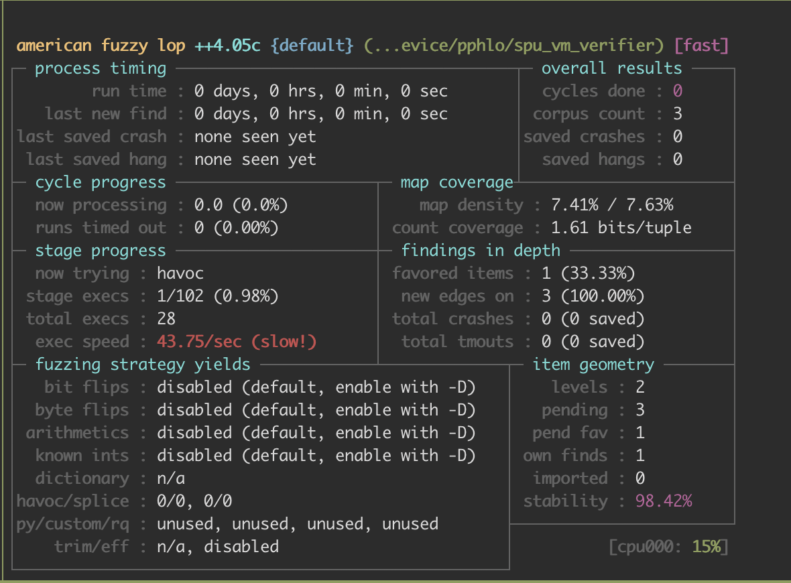

# PPHLO Fuzzing

## AFLplusplus Setup

The fuzzing environment, utilizing the `AFLplusplus 4.05c` framework, has been successfully tested on the `Ubuntu 22.04` operating system.
For more details, please refer to <https://github.com/AFLplusplus/AFLplusplus/blob/stable/docs/INSTALL.md>

```sh
cd libspu/fuzzing/pphlo
sudo apt-get update
sudo apt-get install -y build-essential python3-dev automake cmake git flex bison libglib2.0-dev libpixman-1-dev python3-setuptools cargo libgtk-3-dev
# try to install llvm 12 and install the distro default if that fails
sudo apt-get install -y lld-12 llvm-12 llvm-12-dev clang-12 || sudo apt-get install -y lld llvm llvm-dev clang
sudo apt-get install -y gcc-$(gcc --version|head -n1|sed 's/\..*//'|sed 's/.* //')-plugin-dev libstdc++-$(gcc --version|head -n1|sed 's/\..*//'|sed 's/.* //')-dev
sudo apt-get install -y ninja-build # for QEMU mode
git clone https://github.com/AFLplusplus/AFLplusplus
cd AFLplusplus
git checkout 4.05c # We have successfully test in the 4.05c version.
patch -p1 ../config.patch # increase the bitmap size to mitigate the hash collision problem
make source-only
```

When `AFLplusplus` is successfully compiled, `afl-fuzz`, `afl-gcc-fast`, and `afl-gcc-fast++` will be generated in the `AFLplusplus` directory.

## SPU Compiler Fuzzing

We use `afl-gcc-fast` to perform spu compiler compilation instrumentation. Then use `afl-fuzz` to fuzz the spu compiler.

```sh
CC=libspu/fuzzing/pphlo/AFLplusplus/afl-gcc-fast CXX=libspu/fuzzing/pphlo/AFLplusplus/fuzzing/afl-g++-fast bazel build //libspu/fuzzing/pphlo/fuzzing:spu_vm_verifier --config=asan -c opt
mkdir -p libspu/fuzzing/pphlo/AFL_IN libspu/fuzzing/pphlo/AFL_OUT
echo "aaa" > libspu/fuzzing/pphlo/AFL_IN/1 # prepare a seed
sudo libspu/fuzzing/pphlo/AFLplusplus/afl-system-config # setup fuzzing environment
libspu/fuzzing/pphlo/AFLplusplus/afl-fuzz -m none -t 5000 -i libspu/fuzzing/pphlo/AFL_IN -o libspu/fuzzing/pphlo/AFL_OUT -- ./bazel-bin/libspu/fuzzing/pphlo/spu_vm_verifier @@
```

When this panel appears, spu compiler fuzzing process successfully starts.

