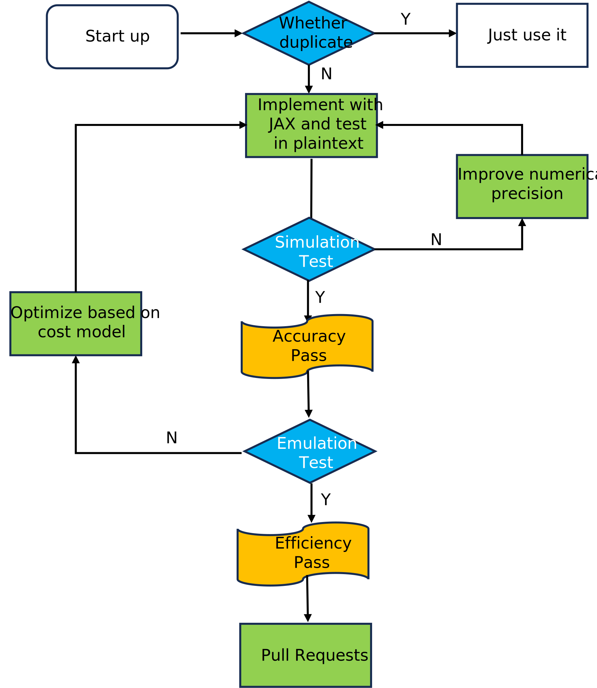

# Development

We welcome developers of all skill levels to contribute their expertise.
There are many ways to contribute to SML including reporting a bug, improving the documentation and contributing new algorithm.
Of course, if you have any suggestion or feature request, feel free to open an [issue](https://github.com/secretflow/spu/issues).

## Submitting a bug report

If you want to submit an issue, please do your best to follow these guidelines which will make it easier and quicker to provide you with good feedback:

- Contains a **short reproducible** code snippet, so anyone can reproduce the bug easily
- If an exception is raised, please provide **the full traceback**.
- including your operating system type, version of JAX, SPU(or commit id)

## Contributing code

> 1. To avoid duplicating work, it is highly advised that you search through the issue tracker and the PR list.
> If in doubt about duplicated work, or if you want to work on a non-trivial feature,
> it's **recommended** to first open an issue in the issue tracker to get some feedbacks from core developers.
> 2. Some essential [documents](https://www.secretflow.org.cn/docs/spu/latest/en-US) about SPU are highly recommended.
[This](../docs/tutorials/develop_your_first_mpc_application.ipynb) is a good first tutorial for new developers,
[pitfall](../docs/development/fxp.ipynb) will be a cheatsheet when you come across numerical problem.

The preferred way to contribute to SML is to fork the main repository, then submit a “pull request” (PR).

1. Create a GitHub account if you do not have one.
2. Fork the [project repository](https://github.com/secretflow/spu),
your can refer to [this](https://docs.github.com/en/get-started/quickstart/fork-a-repo) for more details.
3. Following the instructions on [CONTRIBUTING](../CONTRIBUTING.md), installing the prerequisites and running tests successfully.
4. Develop the feature on **your feature branch** on your computer,
using [Git](https://docs.github.com/en/get-started/quickstart/set-up-git) to do the version control.
5. Following [Before Pull Request](<./development.md#Before Pull Request>) to place or test your codes,
[these](https://docs.github.com/en/pull-requests/collaborating-with-pull-requests/proposing-changes-to-your-work-with-pull-requests/creating-a-pull-request-from-a-fork)
 to create a pull request from your fork.
6. Committers do code review and then merge.

## Before Pull Request

When finishing your coding work, you are supposed to do some extra work before pulling request.

1. **Make sure your code is up-to-date**: It is often helpful to keep your local feature branch **synchronized** with
the latest changes of the main SPU repository.
2. **Place your codes properly**: Generally speaking, for every algorithm, at least 3 files are needed
(e.g. for kmeans, check [PR](https://github.com/secretflow/spu/pull/277/files) as an example).
   - `kmeans.py`: implementation of algorithm or new features, it should be a **"jit-able"** program which run correctly in plaintext
   (same or near to output from scikit-learn).
   - `kmeans_test.py`: a unittest python file, in which you test your program with **simulator**, then you should report the behavior
   (like correctness or error rate) under MPC setting.
   - `kmeans_emul.py`: similar to the above file, except you will test program with **emulator**,
   then you can get sense of efficiency under different MPC protocols.
3. **Other things**: there are still some small fixes to do.
   - **Add copyright**: see [this](<../CONTRIBUTING.md#Contributor License Agreement>) for details.
   - **Add necessary doc**: your implementation may only have part features, or some changes have been made for limitation of both JAX and SPU,
    you **MUST** describe these things explicitly!
   - **Add/change bazel file**: currently, we adopt [bazel](https://github.com/bazelbuild/bazel) to manage our module,
   so you might need add some [python rules](https://bazel.build/reference/be/python) in `BUILD.bazel`.
   - **Format all your files**: using [buildifier](https://github.com/bazelbuild/buildtools/tree/master/buildifier) to format bazel file,
    [black](https://github.com/psf/black) to format python file, [isort](https://github.com/PyCQA/isort) to sort the python imports.
